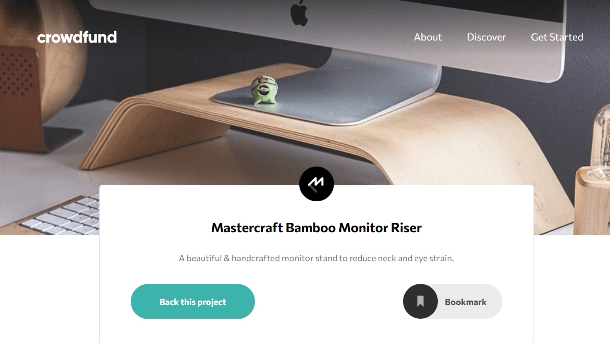
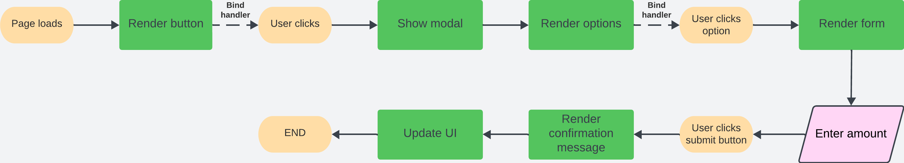
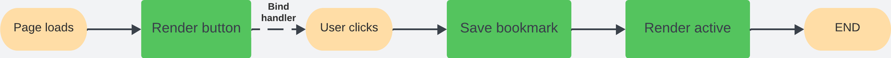
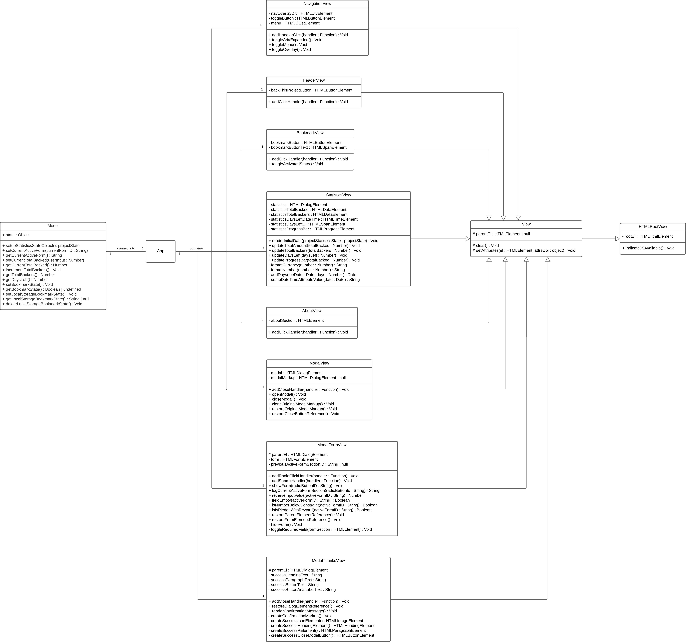

# Frontend Mentor - Crowdfunding product page

This is a solution to the [crowdfunding product page challenge on Frontend Mentor](https://www.frontendmentor.io/challenges/crowdfunding-product-page-7uvcZe7ZR). Frontend Mentor challenges help you improve your coding skills by building realistic projects.

Difficulty: `junior`

[//]: # 'Insert screenshot below'

_Small preview. For entire challenge, visit [the Netlify page](https://crowdfunding-product-page-yari-morcus.netlify.app)_

## Table of contents

- [Frontend Mentor - Crowdfunding product page](#frontend-mentor---crowdfunding-product-page)
  - [Table of contents](#table-of-contents)
  - [Deployment status](#deployment-status)
  - [Overview](#overview)
    - [The challenge](#the-challenge)
    - [Links](#links)
  - [My process](#my-process)
    - [Built with](#built-with)
    - [What I learned](#what-i-learned)
    - [Continued development](#continued-development)
    - [Useful resources](#useful-resources)
  - [Project information](#project-information)
    - [User stories and features](#user-stories-and-features)
    - [Flowcharts](#flowcharts)
      - [User story 1 and 2](#user-story-1-and-2)
      - [User story 3](#user-story-3)
    - [Class diagram](#class-diagram)
  - [Author](#author)

## Deployment status

## Overview

### The challenge

To build the crowdfunding product page according to the given designs as close as possible.
The users should be able to:

- View the optimal layout depending on their device's screen size
- See hover states for interactive elements
- Make a selection of which pledge to make
- See an updated progress bar and total money raised based on their pledge total after confirming a pledge
- See the number of total backers increment by one after confirming a pledge
- Toggle whether or not the product is bookmarked

### Links

- Solution URL: [Open GitHub repository](https://github.com/YariMorcus/fm-crowdfunding-product-page)
- Live Site URL: [open Netlify](https://crowdfunding-product-page-yari-morcus.netlify.app)

## My process

### Built with

- Semantic HTML5 markup
- CSS _(BEM naming convention used, [see getbem.com](http://getbem.com) for more information)_
- Flexbox
- Grid
- ES6 classes
- ES6 modules
- TypeScript
- localStorage (Web Storage API)
  - _This has only been implemented for the bookmark functionality_
- Mobile-first workflow
- Optimized for both Open Graph (Facebook) and Twitter Cards
- [Node.js](https://nextjs.org/) - Open source and multi platform JavaScript runtime environment
- [NPM](https://www.npmjs.com/) - Package Manager for Node JavaScript platform
- [Parcel](https://parceljs.org/) - Zero configuration build tool / module bundler to automate workflow
- [Sass](https://sass-lang.com/) - CSS Preprocessor (in collaboration with Parcel)
- [GitHub](https://github.com/) - Technological platform based on Git
- [Git](https://git-scm.com/) - Free and open source distributed version control system
- [Netlify](https://www.netlify.com/) - Free service to host static webpages and web applications

### What I learned

1. Always use semantic compliant-standard HTML
2. To implement an accessible mobile navigation with progressive enhancement
3. How to create a modal with a form with vanilla JS
4. Implementing TypeScript into my project
5. To keep testing the application for Web Accessibility
6. To spend time looking at the details of the designs to create the application as accurately as possible
7. How to solve problems with a framework _(provided by a [course](https://www.udemy.com/course/the-complete-javascript-course/) I followed)_

### Continued development

The way I want to continue to develop myself is by focusing on laying out a proper foundation of HTML, CSS, JavaScript and TypeScript.
This so I can build quality websites for clients by just using the core languages of the Web.

Another way I want to improve my knowledge of these subjects is to do more challenges that [Frontend Mentor](https://www.frontendmentor.io/challenges) is offering, starting at the lowest level, and building that up to the more advanced ones.

Besides the above, I want to continue to develop myself by using several tools more often to improve my workflow. and spend less time doing things that can be automated.

A few tools that I will start using more often are:

1. Gulp
2. Parcel
3. Git
4. GitHub
5. Netlify (in combination with Continues Deployment)

_I will learn the above points in between but do not want to focus too much on those at the moment._

As soon as I am capable of creating quality websites with the core languages of the Web, I will start to learn JavaScript libraries and frameworks. Both of these change over time, so I do not want to spend my time on those before I have a solid understanding of prior mentioned languages.

### Useful resources

- [Transfonter](https://transfonter.org) - Has been used to convert the downloaded font files to woff and woff2 (most recent font formats, supported in all major browsers), and generate the corresponding `@font-face` css rulesets
- [Frontend Mentor - Crowdfunding product page challenge](https://www.frontendmentor.io/challenges/crowdfunding-product-page-7uvcZe7ZR)

## Project information

### User stories and features

1. As a user, I want to select a pledge so I can give money

   |     | Features                            | Part of |
   | --- | ----------------------------------- | ------- |
   | 1   | A button that opens a modal         |         |
   | 2   | A modal that shows several options  |         |
   | 3   | A form to fill in the pledge amount | Modal   |
   | 4   | A button to confirm the form        | Modal   |

2. As a user, I want to have confirmation that my money has been transferred

   |     | Features                                | Part of  |
   | --- | --------------------------------------- | -------- |
   | 1   | Show confirmation message               | Modal    |
   | 2   | Update progress bar for visual feedback | Homepage |
   | 3   | Update total raised money               | Homepage |
   | 4   | Update total backers by one             | Homepage |

3. As a user, I want to bookmark the product for future reference

   |     | Features                               | Part of  |
   | --- | -------------------------------------- | -------- |
   | 1   | A button to add bookmark functionality | Homepage |

### Flowcharts

#### User story 1 and 2

#### User story 3

### Class diagram

## Author

- LinkedIn - [Yari Morcus](https://www.linkedin.com/in/yarimorcus) _(must be logged in)_
- Frontend Mentor - [@YariMorcus](https://www.frontendmentor.io/profile/YariMorcus)
